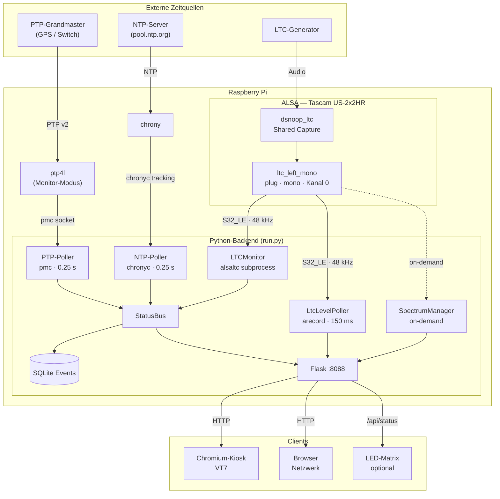
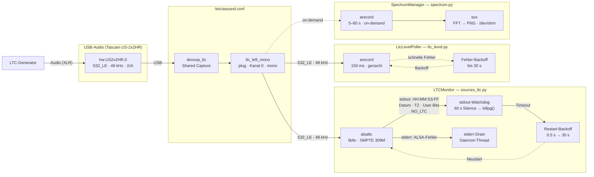

# Time Reference Monitor – Studio Bundeshaus

Monitoring-Tool für Zeitreferenzen in professionellen Broadcast-Umgebungen.
Überwacht **PTP (IEEE 1588)**, **NTP (chrony)** und optional **LTC (Linear Timecode)** — ohne die Systemzeit zu disziplinieren.

---

## Übersicht

| Signal | Quelle | Anzeige |
|--------|--------|---------|
| PTP | `pmc` (linuxptp) → `offsetFromMaster` | PTP-Grandmaster-Zeit, Offset, Delay, Port-State, GM-Identity |
| NTP | `chronyc tracking` → `System time: X slow/fast` | NTP-Referenzzeit, Synchronisationsstatus, Stratum |
| LTC | `alsaltc` / `ltcdump -d -F` (ALSA + libltc) | Timecode HH:MM:SS:FF, Präsenz, Decode-Fehler, Sprünge, Delta zu PTP/NTP, Datum + Timezone (SMPTE 309M User Bits), rohe User Bits |

Alle Werte werden nur **angezeigt und bewertet** — keine Zeitdisziplinierung, kein Eingriff in laufende Dienste.

### Zeitquellen — messtechnische Trennung

Jede der drei Zeitreihen zeigt die **direkte Messung ihrer eigenen Referenz**, nicht den Systemclock:

| Anzeige | Berechnung | Basis |
|---------|-----------|-------|
| **PTP** | `Systemclock − offsetFromMaster` | ptp4l misst `offsetFromMaster = Slave − Master` → Grandmaster-Zeit |
| **NTP** | `Systemclock + system_offset_s` | `chronyc tracking` liefert `"X seconds slow/fast of NTP time"` |
| **LTC** | direkter dekodierter Timecode | ltcdump → ALSA-Capture → libltc, Lokalzeit des LTC-Generators |

Das setzt voraus, dass:
- **chrony** den Systemclock ausschliesslich über NTP diszipliniert (keine PTP-Refclock — siehe `rpi/chrony/chrony.conf`)
- **ptp4l** im Monitor-Modus (`free_running 1`) läuft — misst Offset, greift aber **nicht** in den Systemclock ein (siehe `rpi/ptp4l/ptp4l.conf`)

Beide Bedingungen werden durch `setup.sh` / `update.sh` automatisch konfiguriert.

**Δ(NTP-PTP):** Wenn chrony `system_offset_s` liefert und ptp4l `offset_ns` meldet:
```
Δ(NTP-PTP) = chrony_system_offset_s × 1000 + ptp_offset_ns / 1e6  [ms]
```
Andernfalls Fallback auf `offset_ns / 1e6` allein (= Δ(Systemclock − PTP)).

---

## Architektur

### Systemaufbau

Die drei Zeitquellen werden unabhängig voneinander abgetastet und im gemeinsamen `StatusBus` zusammengeführt. Flask dient ausschliesslich als Read-Only-API — alle Messungen laufen in Hintergrund-Threads.



### LTC-Signalfluss

Drei parallele ALSA-Clients greifen auf dasselbe physische Interface zu. `dsnoop_ltc` serialisiert den Hardware-Zugriff; `ltc_left_mono` (type plug) übernimmt Format- und Kanalkonvertierung. `stderr` des alsaltc-Subprozesses wird im separaten Drain-Thread verworfen — ALSA-Fehlermeldungen erreichen so nicht den stdout-Watchdog und blockieren ihn nicht.



---

## Web-Interface & Analysetools

Das Web-Interface ist unter `http://<host>:8088/` erreichbar und besteht aus fünf Seiten:

| Seite | URL | Funktion |
|-------|-----|----------|
| **Haupt-Dashboard** | `/` | PTP/NTP/LTC-Status, 7-Seg-Zeitanzeige, rollende Fehlerzähler, Ereignisprotokoll |
| **Screen Clock** | `/ltc-clock` | Vollbild-Uhr (LTC/PTP/Local), konfigurierbare Schrift/Farbe/Breite, Close-Button |
| **LTC Spektrum** | `/spectrum` | On-Demand-WAV-Aufnahme (arecord) + FFT-Spektrogramm (sox), PNG- und WAV-Download |
| **LTC Raw Output** | `/ltc-raw` | Live-Ausgabe des LTC-Decoder-Prozesses (`ltcdump`/`alsaltc`), Ring-Buffer 500 Zeilen, Pause-Button, Diagnosewerkzeug |
| **PTP Capture** | `/tcpdump` | Echtzeit-tcpdump von PTP-Paketen (UDP 319/320 + EtherType 0x88F7), Live-Terminal mit Colorierung, PCAP-Download |
| **Einstellungen** | `/settings` | Netzwerk (DHCP/statisch), NTP-Server, WLAN, PTP-Domain-Scanner, PTP/NTP-Simulation, Gerät/Standort |

### Haupt-Dashboard (`/`)

Das Dashboard zeigt alle drei Zeitquellen gleichzeitig in Echtzeit.

**Header-Navigation:** Ein `☰ Menu`-Button in der Kopfzeile öffnet beim Hover ein Dropdown mit allen Navigationslinks (Screen Clock, LTC Spektrum, PTP Capture, Einstellungen) sowie den Systemaktionen Reload, Reboot und Shutdown. Die Zeitanzeige-Karte wird dadurch von Buttons freigehalten.

**7-Segment-Zeitanzeige:** PTP-, NTP- und LTC-Zeit in Echtzeit, client-seitig monoton interpoliert:
- Kein Rückläufer bei Netzwerk-Jitter (neue Serverzeit wird nur übernommen wenn ≥ aktuelle interpolierte Zeit)
- Stabile Spaltenbreite durch Platzhalter `00:00:00.00` (Seg7-Schrift hat gleiche Zeichenbreite für Ziffern und `0`)
- Status-Spalte mit fixer Breite (140 px); lange Texte wie `present 25fps` oder `stale 200s` umbrechen innerhalb der Spalte ohne Layout-Verschiebung
- **TZ-Badge** direkt unter dem Status-Indikator jeder Quelle: zeigt den effektiven UTC-Offset, der auf die angezeigte Zeit angewendet wird (`UTC+02:00` in Blau wenn TZ-Korrektur aktiv, gedämpft wenn UTC, `—` wenn keine Daten). LTC zeigt den aus dem Stream stammenden Offset (unabhängig von der System-Timezone).

**PTP-Status** (zweispaltig):

| Linke Spalte | Rechte Spalte |
|---|---|
| State, Port state, PTP valid, GM present | Source (real/mock), Time source (GPS/NTP/…) |
| Interface, Domain, PTP version | UTC offset, Time/Freq traceable, PTP timescale |
| Offset (ns), Path delay (ns), Poll age (ms) | GM identity, Parent port |
| GM changes, NO PTP since | GM priority1/2, GM clock class/accuracy |

Zusätzliche PTP-Felder werden aus `GET TIME_PROPERTIES_DATA_SET` (via `pmc`) gewonnen: Time Source (dekodiert, z.B. `GPS`, `NTP`, `ATOMIC_CLOCK`), Traceability-Flags, UTC-Offset, PTP-Timescale. `PTP version` zeigt nur `v2` wenn PTP tatsächlich aktiv ist.

**NTP-Status** (zweispaltig, getrennt von PTP durch horizontale Linie):

| Linke Spalte | Rechte Spalte |
|---|---|
| Status, Stratum, Reference | System offset (ms) |
| Last update (Ref time UTC), Update age | RMS offset (ms) |
| | Frequency (ppm) |

**NTP-Staleness-Erkennung:** Wenn `Ref time (UTC)` länger als `--ntp-stale-threshold-s` (Standard 1200 s) nicht aktualisiert wurde, wird der Status auf `stale` gesetzt — auch wenn chrony intern noch `synced` meldet. Hintergrund: chrony's adaptives Polling kann bei stabilem Systemclock bis auf `maxpoll=10` (= 2^10 = 1024 s ≈ 17 min) ansteigen. Ein Threshold unterhalb dieses Werts löst Fehlalarme während normaler Langpoll-Zyklen aus. Der Standard von 1200 s liegt ~3 min über dem maximalen Poll-Intervall. Die NTP 7-Seg-Anzeige graut bei `stale` oder `unsynced` aus. Status-Werte: `synced` (grün) / `stale <Ns>` (gelb) / `unsynced` (rot) / `unknown` (grau).

**LTC-Status** (zweispaltig, nach NTP):

| Linke Spalte | Rechte Spalte |
|---|---|
| Timecode (raw, HH:MM:SS:FF), Frame rate, ALSA delay, Update age | Date (YYYY-MM-DD), Timezone (UTC±HH:MM), User Bits (Hex, z.B. `64 26 04 08`) |

Die LTC-7-Seg-Anzeige zeigt den rohen Timecode des LTC-Generators — LTC kodiert nach Konvention **Lokalzeit**. Wenn die Timezone aus den User Bits bekannt ist (SMPTE 309M) oder aus dem Datum-vs.-PTP-Vergleich abgeleitet wurde, erscheint der erkannte UTC-Offset als Badge direkt unter dem `present`-Statusindikator.

`alsaltc` dekodiert Datum und Timezone via `ltc_frame_to_time(..., LTC_USE_DATE)` (libltc SMPTE 309M) und gibt sie als `YYYY-MM-DD ±HHMM HH:MM:SS:FF` aus — dasselbe Format wie `ltcdump -d -F`. Fallback-Parser-Kette für alle ltcdump-Ausgabeformate vorhanden (siehe Konzept).

**LTC-Pegel:** Kompakter LED-Bargraph (30 Segmente, −60 dBFS bis 0 dBFS) mit inline dBFS-Textanzeige rechts daneben. Farbbereiche: grün (< −18 dBFS), orange (−18 bis −6 dBFS), rot (> −6 dBFS). Peak-Hold 800 ms.

**Rollende Fehlerzähler:** Alle Ereignisse (PTP_LOST, NTP_STALE, NTP_LOST, LTC_LOST, GM_CHANGED, Offset-Sprünge, Drift) fliessen in das Rolling-Error-Summary ein. Ein **Reset-Button** setzt alle Zähler sofort auf 0 zurück. Fehlerfenster konfigurierbar via `--error-window-s` (Standard 1 h).

**Δ-Werte:** Vier Paare im Delta-Raster: NTP Date / PTP Date, NTP TZ / System TZ (PTP), Δ(NTP-PTP) / Δ(LTC-NTP), Δ(LTC-PTP) adj / Δ(LTC-PTP) raw. ALSA delay wird im LTC-Status-Block angezeigt (nicht im Delta-Raster).

**Ereignisprotokoll:** Alle Statusübergänge mit UTC-Timestamp, Schweregrad (INFO/WARN/ALARM) und Typ.

### Screen Clock (`/ltc-clock`)

Vollbild-Uhr für den Kiosk-Betrieb oder als separates Display:
- Zeitquelle per Dropdown wählbar: **LTC** (dekodierter Timecode), **PTP** (UTC, API-gestützt), **Local** (Browser-Systemzeit)
- Schriftgrösse, Farbe und Breite individuell konfigurierbar — persistiert im Browser-Localstorage
- Close-Button für Kiosk-Betrieb (kehrt zum Dashboard zurück)
- Monotone Interpolation verhindert Zeitrückläufer auch bei Netzwerk-Jitter

### LTC Spektrum (`/spectrum`) — Signalqualitäts-Diagnose

On-Demand-Werkzeug zur Diagnose des LTC-Audiosignals:

**Ablauf:** `arecord` (ALSA, `dsnoop_ltc`) → `sox` FFT → PNG-Spektrogramm. Alle Dateien landen in `/dev/shm` (RAM-Disk) — **keine SD-Karten-Schreibzugriffe**.

**Analysenutzen:**
- LTC-Signal bei 25 fps SMPTE liegt im Bereich ~600 Hz – 2,4 kHz. Das Spektrogramm zeigt sofort, ob das Signal im richtigen Frequenzband liegt
- Rauschen (breitbandig), Netzbrumm (50/100 Hz-Peaks), oder falsche Pegel sind direkt sichtbar
- **WAV-Download und PNG-Download**: Beide Dateien werden mit Zeitstempel im Format `YYYYMMDD-HH_MM_SS_UTC-LTC_Capture.{wav,png}` benannt — so können mehrere Aufnahmen unterschieden werden, ohne Überschreiben
- Typische Befunde: Kabeldefekt (Rauschteppich), Pegelregler falsch (zu leise → Dekodierungsfehler), Erder-Schleife (50-Hz-Brumm)

### PTP Capture (`/tcpdump`) — Protokollanalyse

Echtzeit-Erfassung und Analyse von PTP-Paketen direkt im Browser:

**Erfasste Pakete:**
- UDP Port 319 (Event Messages: Sync, Delay_Req, Pdelay_Req/Resp)
- UDP Port 320 (General Messages: Announce, Follow_Up, Delay_Resp)
- EtherType 0x88F7 (PTP over Ethernet Layer 2, Multicast)

**Darstellung:**
- Live-Terminal mit farblicher Hervorhebung nach Nachrichtentyp
- Ring-Buffer 500 Zeilen
- PCAP-Download für Analyse mit Wireshark

**Lehrwert und Analysenutzen:**
- **Protokollverständnis ohne Spezialhardware**: Sichtbar, welche Nachrichtentypen ausgetauscht werden (Sync/Follow_Up für Two-Step-Clocks, Delay_Req/Resp für Path-Delay-Messung, Announce für GM-Election)
- **Alle aktiven PTP-Domains**: Pakete aus verschiedenen Domains sind sichtbar — nützlich in Broadcast-Umgebungen mit mehreren parallelen PTP-Domains (AES67, ST 2110, DANTE)
- **Grandmaster-Identität**: Announce-Pakete enthalten Clock Identity, Priority1/2, Clock Class — erkennbar ohne pmc
- **Asymmetrische Pfade erkennen**: Delay_Req/Resp-Verhältnis gibt Hinweise auf asymmetrische Switch-Latenz
- **Multicast-Gruppen**: 224.0.1.129 (PTP v2 General), 224.0.0.107 (Peer Delay), 01:1b:19 (L2 Multicast)

### Einstellungen (`/settings`)

Die Einstellungsseite bündelt alle Konfigurationsoptionen, die zur Laufzeit geändert werden können:

| Karte | Funktion |
|-------|----------|
| **Gerät / Standort** | Freitext-Bezeichnung des Geräts (erscheint im Dashboard) |
| **PTP Domain** | PTP-Domain scannen und zur Laufzeit wechseln (siehe unten) |
| **Netzwerk** | DHCP / statische IP, Subnetzmaske, Gateway, DNS |
| **NTP-Server** | Exklusiven NTP-Server zur Laufzeit setzen — ersetzt alle pool/server-Einträge in `chrony.conf`; persistiert in `/var/lib/time-reference-monitor/ntp_server` |
| **Zeitzone** | System-Zeitzone via `timedatectl set-timezone` setzen; Offset im Dashboard erscheint nach ≤ 30 s |
| **WLAN** | WiFi-Radio ein-/ausschalten |
| **API-Zugriff** | IP/Subnet-Allowlist für Web-Interface und API; leer = alle erlaubt; `127.0.0.1`/`::1` immer erlaubt |
| **NTP-Simulation** | Synthetischen NTP-Ausfall oder -Sprung simulieren |
| **PTP-Simulation** | Synthetische PTP-Fehler erzeugen (GM-Flap, Dropout, Offset-Sprung, Wander, Drift) |

#### PTP-Simulation (Mock-Modus)

Im Mock-Modus (`--source mock`) können synthetische Fehler gezielt ausgelöst werden — nützlich für:
- Training von Alarm-Schwellwerten ohne echte Fehler
- Test von Monitoring-Setups (reagiert das Alerting korrekt?)
- Dokumentation von Fehlerbildern

Verfügbare Fault-Typen: **Dropout** (PTP-Signal fällt weg), **GM-Flap** (Grandmaster wechselt), **Step Jump** (Offset-Sprung), **Wander** (langsames Offset-Driften), **Drift** (kontinuierliches Wegdriften).

### PTP-Domain-Scanner

Der Domain-Scanner in `Einstellungen > PTP Domain` ermittelt automatisch alle aktiven PTP-Domains im Netzwerk:

**Funktionsweise:**
1. `tcpdump` erfasst 500 PTP-Pakete (L2 EtherType 0x88F7, UDP 319/320)
2. Ein reiner Python-PCAP-Parser extrahiert das Feld `domainNumber` (Byte 4 des PTP-Headers) — ohne externe Abhängigkeiten
3. Unterstützt L2 (Ethernet), IPv4, IPv6 und VLAN-getaggte Frames
4. Ergebnis: Liste aller gefundenen Domain-Nummern mit Vorkommen-Zähler

**Domain zur Laufzeit wechseln:**

| Aktion | Wirkung |
|--------|---------|
| **Aktiv (bis Reboot)** | Wechselt die Domain sofort für die aktuelle Sitzung; kein Schreibzugriff |
| **Aktiv & Speichern** | Wechselt die Domain und schreibt sie in die Persistenz-Datei |

**Persistenz:** `/var/lib/time-reference-monitor/ptp_domain`
- Beim Dienststart wird diese Datei gelesen und überschreibt den `--domain`-CLI-Parameter
- Damit sind Domain-Änderungen über Neustarts hinweg wirksam, ohne die systemd-Unit-Datei zu editieren

**pmc-Aufruf:** Der Monitor ruft `pmc` mit `-d N` auf (Domain-Nummer), **nicht** `-b N` (Boundary Hops — ein anderer Parameter, der die Hop-Tiefe bei pmc-Abfragen steuert).

#### Δ-Berechnungen — Zeitquellen in Relation

Die drei Δ-Werte zeigen die tatsächlichen Beziehungen zwischen den Zeitquellen in einer Broadcast-Umgebung:

| Delta | Formel | Bedeutung |
|-------|--------|-----------|
| **Δ(NTP–PTP)** | `chrony_offset_ms + ptp_offset_ms` | Differenz zwischen NTP-Referenzzeit und PTP-Grandmaster |
| **Δ(LTC–PTP) adj** | `ltc_s − ptp_s − alsa_delay_ms/1000` | LTC-Generator vs. PTP-Grandmaster, Capture-Delay kompensiert |
| **Δ(LTC–PTP) raw** | `ltc_s − ptp_s` | LTC vs. PTP ohne Delay-Kompensation |
| **Δ(LTC–NTP)** | `ltc_s − ntp_s − alsa_delay_ms/1000` | LTC-Generator vs. NTP-Referenz, Capture-Delay kompensiert |

Die ALSA-Capture-Latenz (`alsa_delay_ms`) wird automatisch beim ersten LTC-Frame gemessen (`period_size / sample_rate`) und von den kompensierten LTC-Deltas subtrahiert. Der Wert wird im LTC-Status-Block angezeigt (nicht mehr im Delta-Raster).

---

## Voraussetzungen

### Hardware-Kompatibilität (Raspberry Pi + PTP)

PTP-Genauigkeit hängt direkt davon ab, ob das Netzwerk-Interface **Hardware-Timestamping** unterstützt. Folgende RPi-Modelle unterscheiden sich grundlegend:

| Modell | PTP Hardware-Timestamping | Empfehlung |
|--------|--------------------------|------------|
| **RPi 4 Model B** | Nein (BCM54213PE, kein IEEE 1588) | Funktioniert nur mit Software-Timestamps (`-S`), ~10–100 µs Genauigkeit |
| **RPi 5** | Ja (MAC-Level via RP1-Chip) — aber **wiederholte Kernel-Regressionen** | Nicht empfohlen für unbeaufsichtigten Produktionsbetrieb |
| **RPi CM4** | Ja (PHY-Level, BCM54210PE) | Stabil, ~5–15 ns auf direktem Link, ~5–6 µs über Switches |
| **RPi CM5** | Ja (PHY + MAC) | Beste Option; vollständige Unterstützung ab Kernel 6.12; `setup.sh` erkennt HW-Timestamping automatisch via `ethtool -T` |

**RPi 4 Model B:** ptp4l muss im Software-Timestamp-Modus betrieben werden. In `rpi/ptp4l/ptp4l.conf` ist bereits `time_stamping software` gesetzt — das passt für den RPi 4. Kein `-S`-Flag auf der Kommandozeile nötig. Für ein reines Monitoring-Tool (kein Grandmaster) ist die resultierende Genauigkeit von ~10–50 µs oft ausreichend.

**RPi 5:** Hardware-Timestamping ist im Kernel vorhanden (MAC-Level via RP1-Chip), aber seit 2024 gibt es wiederholte Regressionen. **Raspberry Pi OS Bookworm (Stand Anfang 2026) ist betroffen** — Kernel 6.12.25–6.12.35 funktioniert nicht. Kernel 6.12.10 und 6.15 sind stabil. Workaround bis ein Fix landet: `sudo rpi-update` für einen neueren Pre-Release-Kernel, oder Software-Timestamps mit `-S`.

Hardware-Timestamping auf RPi 5 / CM5 erfordert zwei Einträge in `ptp4l.conf` (sonst werden Timestamps stillschweigend verworfen):
```ini
time_stamping  hardware
hwts_filter    full
```
`setup.sh` setzt diese Einträge bei der Installation **automatisch**, sofern `ethtool -T eth0` Hardware-Timestamping meldet. Für manuelle Anpassung: `/etc/linuxptp/ptp4l.conf` bearbeiten und `ptp4l` neu starten.

**Prüfen ob Hardware-Timestamping verfügbar ist:**
```bash
ethtool -T eth0
# Hardware-Timestamping: "PTP Hardware Clock: 0" muss erscheinen
# Software-only: "PTP Hardware Clock: none"
```

### System
- Raspberry Pi OS Bookworm (64-bit) empfohlen, oder Debian/Ubuntu
- Python 3.10+

### Laufzeitabhängigkeiten
```
apt install linuxptp chrony alsa-utils
```

### Python-Pakete
```
pip install -r requirements.txt   # Flask>=2.2
```

### Für LTC-Dekodierung (alsaltc)
```
apt install libasound2-dev libltc-dev gcc make pkg-config
cd alsaltc-v02 && make && sudo make install
```

`alsaltc` muss auf dem Zielsystem (ARM) aus den Quellen kompiliert werden. Der Decoder gibt Datum, Timezone und User Bits direkt aus dem LTC-Frame aus (SMPTE 309M via `ltc_frame_to_time(..., LTC_USE_DATE)`):

**Ausgabeformat:** `YYYY-MM-DD ±HHMM HH:MM:SS:FF AABBCCDD`
- `YYYY-MM-DD` — Datum aus User Bits
- `±HHMM` — Timezone aus User Bits
- `HH:MM:SS:FF` — SMPTE-Timecode
- `AABBCCDD` — rohe User Bits (8 Hex-Nibbles), für den Fall dass User Bits nicht für Datum/TZ genutzt werden

Wenn Datum oder Timezone in den User Bits fehlt, werden die fehlenden Felder weggelassen.

```bash
cd alsaltc-v02 && make && sudo make install
```

`setup.sh` kompiliert `alsaltc` automatisch beim Deployment — manuelles Neubauen ist nur nötig, wenn `alsaltc` nach einem Update des Source-Codes aktualisiert werden soll.

### ALSA-Capture-Delay

Die LTC-Capture-Latenz (`alsa_delay_ms`) wird beim ersten LTC-Frame automatisch via `arecord --verbose` gemessen. Basis ist `period_size / sample_rate` (= ein ALSA-Interrupt-Periode = tatsächliche Capture-Latenz). Der Wert wird von allen Δ(LTC-*)-Berechnungen abgezogen.

Falls der Wert beim Start `—` zeigt (Gerät war beim Booten noch nicht bereit), wird beim nächsten empfangenen LTC-Frame automatisch nachgemessen.

### Wichtige Startparameter

| Parameter | Standard | Bedeutung |
|-----------|----------|-----------|
| `--poll` | 0.5 s | PTP-Abfrageintervall (`pmc`) |
| `--ntp-refresh-s` | 0.25 s | Wie oft `chronyc tracking` gelesen wird (unabhängig von chrony's eigenem NTP-Poll-Zyklus von 64–1024 s) |
| `--ntp-stale-threshold-s` | 1200 s | Ab welchem Alter von `Ref time (UTC)` NTP als `stale` gilt. Chrony's adaptives Polling kann bis auf `maxpoll=10` (1024 s ≈ 17 min) ansteigen; der Threshold muss darüber liegen. 1200 s = ~3 min Puffer über dem maximalen Poll-Intervall |
| `--error-window-s` | 3600 s | Zeitfenster für rollende Fehlerzähler |
| `--gm-window-s` | 172800 s | Zeitfenster für GM-Wechsel-Zähler (48 h) |
| `--stale-threshold-ms` | 2000 ms | Wie lange ohne frische API-Antwort bis Dashboard-Status auf ALARM wechselt |
| `--startup-grace-s` | 6 s | Startphase: WARN/ALARM-Events werden als `suppressed` markiert bis erster PTP-Lock |
| `--domain` | 0 | PTP-Domain-Nummer; überschrieben durch Persistenz-Datei falls vorhanden |

---

## Schnellstart (Entwicklung / Test)

```bash
# Mock-Modus: simuliert PTP, kein Hardware-Zugriff nötig
python3 run.py \
  --source mock \
  --http --http-host 0.0.0.0 --http-port 8088 \
  --poll 0.25 \
  --mock-jitter-ns 80000 --mock-dropout-every-s 30
```

Dann im Browser: `http://localhost:8088/`

### Mit realer Hardware

```bash
# PTP4L als Slave starten (separates Terminal)
sudo ptp4l -i eth0 -m -q

# Monitor starten
python3 run.py \
  --source real \
  --iface eth0 \
  --domain 0 \
  --http --http-host 0.0.0.0 --http-port 8088 \
  --poll 0.25
```

### Mit LTC (dsnoop für parallelen Zugriff)

```bash
# ALSA-Config installieren (einmalig)
sudo cp rpi/alsa/asound.conf /etc/asound.conf
# → Standard: hw:US2x2HR,0 (Tascam US-2x2HR)
# → Anderes Interface: arecord -l → Kurzname → /etc/asound.conf anpassen

python3 run.py \
  --source real --iface eth0 \
  --http --http-host 0.0.0.0 --http-port 8088 \
  --poll 0.25 \
  --ltc \
  --ltc-device dsnoop_ltc \
  --ltc-fps 25 \
  --ltc-cmd "alsaltc -d ltc_left_mono -r 48000 -c 1 -f 25 --dropout-ms 800" \
  --ltc-dropout-timeout-ms 800 \
  --ltc-jump-tolerance-frames 5
```

---

## Raspberry Pi Kiosk-Deployment

Für den stabilen Gerätebetrieb: Raspberry Pi OS nativ, systemd-Dienste, Chromium-Kiosk beim Booten.

### Betriebsuser `ptp`

Alle Dienste laufen unter dem dedizierten User **`ptp`**. Dieser User existiert auf einem frischen Raspberry Pi OS nicht — das Setup-Script legt ihn automatisch an:

- Home-Verzeichnis: `/home/ptp` (benötigt von X11/xinit)
- Gruppen: `audio`, `video`
- Passwort gesperrt (kein direkter Login)

Der Standardname `ptp` kann überschrieben werden:
```bash
sudo APP_USER=anderer-user bash rpi/setup.sh
```

### Erstinstallation — Schritt für Schritt

Dieser Abschnitt beschreibt den vollständigen Weg von der leeren SD-Karte bis zum laufenden Kiosk.

#### Schritt 1 — Raspberry Pi OS Lite (64-bit) installieren

1. **Raspberry Pi Imager** herunterladen: [raspberrypi.com/software](https://www.raspberrypi.com/software/)
2. Ziel-OS wählen: **Raspberry Pi OS Lite (64-bit)** (kein Desktop)
3. Im Imager **Advanced Options** (`Ctrl+Shift+X`) konfigurieren:
   - Hostname setzen (z.B. `studioref-01`)
   - SSH aktivieren (Public-Key-Authentifizierung empfohlen)
   - Standard-User: `pi` (wird später durch `ptp` ersetzt)
   - WLAN **nicht** konfigurieren — Kiosk läuft ausschliesslich über Ethernet
4. SD-Karte schreiben, einlegen, Pi starten

#### Schritt 2 — Erstzugang via SSH

```bash
ssh pi@<ip-adresse>        # oder: ssh pi@studioref-01.local
```

IP-Adresse im Router-DHCP-Log oder via `nmap -sn 192.168.1.0/24` ermitteln.

#### Schritt 3 — Repository klonen

```bash
sudo apt-get update && sudo apt-get install -y git
git clone https://github.com/<org>/Time-Reference-Monitor.git
cd Time-Reference-Monitor
```

#### Schritt 4 — Setup-Skript ausführen

```bash
sudo bash rpi/setup.sh
```

Das Skript erledigt vollautomatisch:

| Schritt | Aktion |
|---------|--------|
| 1 | User `ptp` anlegen (Home `/home/ptp`, Gruppen `audio`, `video`, `input`; Passwort gesperrt) |
| 2 | System-Pakete installieren: `chromium`, `xorg`, `openbox`, `linuxptp`, `chrony`, `libltc-dev`, `ethtool`, … |
| 3 | `alsaltc` aus Quellen kompilieren und nach `/usr/local/bin/` installieren |
| 4 | `/opt/time-reference-monitor/` anlegen, Python-venv erstellen, Abhängigkeiten installieren |
| 5 | `/etc/asound.conf` installieren (dsnoop-Config für LTC-Capture) |
| 6 | `/etc/chrony/chrony.conf` installieren (NTP-only, kein PTP-Refclock) |
| 7 | `/etc/linuxptp/ptp4l.conf` installieren; **Hardware-Timestamping automatisch erkennen** via `ethtool -T eth0` — CM5/RPi5: `time_stamping hardware` + `hwts_filter full`; RPi4: `time_stamping software` |
| 8 | `/etc/X11/Xwrapper.config` schreiben (`needs_root_rights=yes` für rootless Xorg auf VT7) |
| 9 | systemd-Dienste installieren und aktivieren |
| 10 | sudoers-Regeln für `ptp` (reboot, poweroff, nmcli, timedatectl, …) |
| 11 | WirePlumber maskieren (falls installiert — belegt sonst das ALSA-Device) |
| 12 | `/etc/time-reference-monitor.conf` erstellen (Kiosk-Konfiguration) |
| 13 | HDMI-Modus in `config.txt` setzen (Standard: 1080i50 für SDI-Konverter) |
| 14 | Console-Autologin auf VT1 konfigurieren (Fallback) |

#### Schritt 5 — Konfiguration anpassen

**PTP-Interface** (Standard: `eth0`):
```bash
sudo nano /etc/time-reference-monitor.conf
# PTP_IFACE=eth0   ← nur anpassen wenn abweichend
sudo systemctl daemon-reload
sudo systemctl restart ptp4l time-reference-monitor
```

**LTC-Soundkarte** (Standard: Tascam US-2x2HR):
```bash
arecord -l        # vorhandene Karten auflisten
# Zeile: "card 1: US2x2HR [TASCAM US-2x2HR], device 0: ..."
sudo nano /etc/asound.conf    # pcm "hw:US2x2HR,0" → anpassen
```

**LTC-Framerate** (Standard: 25 fps):
```bash
sudo nano /etc/systemd/system/time-reference-monitor.service
# --ltc-fps 25  →  29 für 29.97/30 fps
sudo systemctl daemon-reload && sudo systemctl restart time-reference-monitor
```

**HDMI-Modus** (Standard: 1080i50 für SDI-Konverter):
```bash
sudo nano /etc/time-reference-monitor.conf
# HDMI_MODE=sdi-1080i50   ← Optionen: sdi-1080i50, sdi-1080p50, auto
sudo bash rpi/update.sh   # aktualisiert config.txt und startet Dienste neu
```

**PTP-Domain** (Standard: 0):
```bash
sudo nano /etc/systemd/system/time-reference-monitor.service
# --domain 0  →  anpassen
```
Oder zur Laufzeit: **Settings → PTP Domain → Aktiv & Speichern** (kein Neustart nötig).

#### Schritt 6 — SSH-Key für `ptp`-User hinterlegen

Da der `ptp`-User kein Passwort hat, ist SSH-Key-Authentifizierung erforderlich:

```bash
sudo mkdir -p /home/ptp/.ssh
sudo sh -c 'echo "ssh-ed25519 AAAA...dein-public-key" >> /home/ptp/.ssh/authorized_keys'
sudo chown -R ptp:ptp /home/ptp/.ssh
sudo chmod 700 /home/ptp/.ssh && sudo chmod 600 /home/ptp/.ssh/authorized_keys
```

#### Schritt 7 — Neustart und Verifikation

```bash
sudo reboot
```

Nach dem Neustart:

```bash
# Dienste prüfen
ssh ptp@<ip>
systemctl status time-reference-monitor ptp4l chrony chromium-kiosk

# PTP-Offset prüfen
journalctl -fu time-reference-monitor | grep offset

# Hardware-Timestamping prüfen (CM5/RPi5)
ethtool -T eth0
# → "PTP Hardware Clock: 0" = Hardware-Timestamps aktiv
# → "PTP Hardware Clock: none" = Software-Timestamps (RPi4 normal)

# Web-Interface
curl http://localhost:8088/api/status | python3 -m json.tool
```

Das Chromium-Kiosk öffnet automatisch `http://localhost:8088/` auf dem HDMI-Ausgang.

---

### Installation (Zusammenfassung)

```bash
# Einmalig als root ausführen:
sudo bash rpi/setup.sh
```

Vollständige Anleitung: siehe **Erstinstallation — Schritt für Schritt** oben.

### Netzwerk-Interface konfigurieren

Das PTP-Interface wird **einmalig** in `/etc/time-reference-monitor.conf` gesetzt — beide Dienste lesen es von dort:

```bash
sudo nano /etc/time-reference-monitor.conf
# PTP_IFACE=eth0   ← anpassen
sudo systemctl daemon-reload
sudo systemctl restart ptp4l time-reference-monitor
```

`ptp4l.service` und `time-reference-monitor.service` lesen `PTP_IFACE` via `EnvironmentFile`. Damit ist die Interface-Konfiguration nur an **einer** Stelle notwendig.

### Konfiguration des Monitor-Dienstes

Die aktiven Start-Parameter stehen in:
```
/etc/systemd/system/time-reference-monitor.service
```

Das Template dazu liegt im Repository unter `rpi/systemd/time-reference-monitor.service` und wird von `setup.sh` / `update.sh` nach `/etc/systemd/system/` kopiert. **Anpassungen immer in `/etc/systemd/system/` vornehmen**, nicht im Repo-Template — sonst werden sie beim nächsten `update.sh` überschrieben.

Nach jeder Änderung:
```bash
sudo systemctl daemon-reload
sudo systemctl restart time-reference-monitor
```

**Aktuelle Defaults nach setup.sh:**

| Parameter | Default | Anmerkung |
|-----------|---------|-----------|
| `--source` | `real` | `mock` nur für Tests ohne PTP-Hardware |
| `--iface` | `${PTP_IFACE:-eth0}` | Wird aus `/etc/time-reference-monitor.conf` gelesen |
| `--domain` | `0` | PTP-Domain-Nummer; kann zur Laufzeit über `Einstellungen > PTP Domain` geändert und in `/var/lib/time-reference-monitor/ptp_domain` gespeichert werden |
| `--poll` | `0.25` s | PTP-Abfrageintervall |
| `--http-host` | `0.0.0.0` | von allen Interfaces erreichbar |
| `--http-port` | `8088` | |
| `--ltc` | aktiviert | LTC deaktivieren: Zeile entfernen |
| `--ltc-device` | `dsnoop_ltc` | ALSA-Gerät (aus asound.conf) |
| `--ltc-fps` | `25` | **anpassen** bei 29.97/30 fps LTC |
| `--ltc-cmd` | `alsaltc -d ltc_left_mono -r 48000 -c 1 -f 25 --dropout-ms 800 --format S16_LE` | |
| `--ltc-dropout-timeout-ms` | `800` | |
| `--ltc-jump-tolerance-frames` | `5` | Bei 25 fps: 1 Frame = 40 ms → 5 Frames = 200 ms Toleranz. Einzelne Ausreisser bis 200 ms lösen keine `LTC_JUMP`-Warnung aus; nur echte Sprünge > 5 Frames werden gemeldet. |
| `--db` | `/var/lib/time-reference-monitor/events.sqlite` | |

### Dienste

| Dienst | Beschreibung |
|--------|-------------|
| `ptp4l.service` | PTP-Slave (Monitor-Modus: `free_running 1`, misst Offset, keine Clockdisziplinierung) |
| `chrony.service` | NTP-Synchronisation des Systemclocks (NTP-only, kein PTP-Refclock) |
| `time-reference-monitor.service` | Python-Backend (PTP/NTP/LTC), Port 8088 |
| `chromium-kiosk.service` | X11 auf VT7 + Chromium im Kiosk-Modus |
| `ssh.service` | SSH-Server (wird durch setup.sh aktiviert) |

```bash
# Logs beobachten
journalctl -fu time-reference-monitor
journalctl -fu chromium-kiosk

# Dienste manuell starten (ohne Reboot)
sudo systemctl start time-reference-monitor
sudo systemctl start chromium-kiosk
```

### SSH-Zugang

`setup.sh` installiert und aktiviert `openssh-server` automatisch. Nach dem ersten Boot ist der Pi per SSH erreichbar:

```bash
ssh ptp@<ip-adresse>
```

Da der `ptp`-User kein Passwort hat, muss die Authentifizierung über SSH-Key erfolgen. SSH-Key vor dem ersten Reboot hinterlegen:

```bash
# Auf dem Pi (als root, nach setup.sh):
mkdir -p /home/ptp/.ssh
echo "ssh-ed25519 AAAA... dein-public-key" >> /home/ptp/.ssh/authorized_keys
chown -R ptp:ptp /home/ptp/.ssh
chmod 700 /home/ptp/.ssh
chmod 600 /home/ptp/.ssh/authorized_keys
```

### Konsolenzugang / Kiosk beenden

Der Chromium-Kiosk läuft auf **Virtual Terminal 7** (VT7). Folgende Wege führen zurück auf eine Textkonsole:

| Methode | Aktion |
|---------|--------|
| Tastatur am Gerät | `Ctrl+Alt+F1` → VT1 (autologin als `ptp`) |
| Tastatur am Gerät | `Ctrl+Alt+F2` → VT2 (Login-Prompt) |
| Zurück zum Kiosk | `Ctrl+Alt+F7` |
| SSH | `ssh ptp@<ip>` von einem anderen Rechner |
| Kiosk-Service stoppen | `sudo systemctl stop chromium-kiosk` (via SSH oder Konsole) |

`Ctrl+Alt+Fn` wird vom Linux-Kernel verarbeitet — Chromium kann diese Tastenkombination nicht blockieren, auch nicht im `--kiosk`-Modus.

**Browser-Absturz:** `chromium-kiosk.service` ist mit `Restart=always` konfiguriert und startet den Kiosk nach jedem Absturz oder sauberem Beenden automatisch neu (nach 10 s). Um den Kiosk dauerhaft zu beenden:
```bash
sudo systemctl stop chromium-kiosk
```

### Fehlerdiagnose: chromium-kiosk startet nicht (VT-Permission)

**Symptom:** `chromium-kiosk.service` startet, beendet sich sofort mit `code=exited, status=1/FAILURE`, Neustart-Zähler steigt an.

**Ursache:** Auf Raspberry Pi OS Bookworm läuft Xorg standardmässig **rootless** (ohne SUID). Damit Xorg ein bestimmtes Virtual Terminal (VT7) öffnen darf, muss `/etc/X11/Xwrapper.config` mit den richtigen Berechtigungen existieren.

**Fehlermeldung im Xorg-Log:**
```
(EE) xf86OpenConsole: Cannot open virtual console 7 (Permission denied)
```

**Log-Pfad auf Bookworm** (nicht `/tmp/Xorg.0.log`!):
```bash
cat /home/ptp/.local/share/xorg/Xorg.0.log | grep EE
```

**Sofort-Fix:**
```bash
sudo mkdir -p /etc/X11
printf 'allowed_users=anybody\nneeds_root_rights=yes\n' | sudo tee /etc/X11/Xwrapper.config
sudo systemctl restart chromium-kiosk
```

`setup.sh` und `update.sh` legen diese Datei automatisch an; auf bestehenden Installationen einmalig manuell ausführen.

### HDMI-Auflösung konfigurieren

Die gewünschte HDMI-Ausgabeauflösung wird in `/etc/time-reference-monitor.conf` festgelegt:

```bash
sudo nano /etc/time-reference-monitor.conf
```

| `HDMI_MODE` | Auflösung | CEA | Pixelclock | Verwendung |
|-------------|-----------|-----|-----------|-----------|
| `sdi-1080i50` | 1920×1080i 50 Hz | 20 | 74.25 MHz | **Standard** — Broadcast-HD für HDMI→SDI-Konverter |
| `sdi-1080p50` | 1920×1080p 50 Hz | 31 | 148.5 MHz | Progressiv-HD für Konverter die p-Signal erfordern |
| `sdi-720p50` | 1280×720p 50 Hz | 19 | 74.25 MHz | HD-Light; gleicher Pixelclock wie 1080i50 |
| `auto` | Monitor-Präferenz | — | — | **PC-Monitor** — native Auflösung des Bildschirms |

Nach der Änderung:
```bash
# Kiosk neu starten (wirksam sofort, kein Reboot nötig):
sudo systemctl restart chromium-kiosk

# config.txt + kiosk gleichzeitig aktualisieren:
sudo bash rpi/update.sh
```

> **PC-Monitor vs. SDI-Konverter:**
> PC-Monitore unterstützen meist 1080p@60Hz, nicht @50Hz. Wenn das Bild an der linken Seite klebt oder nur teilweise angezeigt wird, `HDMI_MODE=auto` setzen. Für den SDI-Konverter `sdi-1080i50` (Standard-Broadcast) oder `sdi-1080p50` verwenden.

Der HDMI-Output wird beim Start automatisch erkannt. Zur Diagnose via SSH:
```bash
DISPLAY=:0 xrandr --query
```

**Hinweis RPi 4 vs. RPi 5:**
- RPi 4: Output heisst `HDMI-1` (erster Anschluss) / `HDMI-2` (zweiter)
- RPi 5 / neuere Kernel: `HDMI-A-1` / `HDMI-A-2`
- Das Script probiert alle Varianten automatisch durch

**RPi Firmware-Konfiguration (`/boot/firmware/config.txt`):**

`setup.sh` und `update.sh` setzen diese Zeilen automatisch basierend auf `HDMI_MODE`:

```ini
hdmi_force_hotplug=1   # HDMI aktiv halten, auch wenn SDI-Konverter kein EDID sendet
hdmi_group=1           # CEA (Broadcast), nicht DMT (PC-Monitor)
hdmi_mode=20           # 1080i50 (Standard) — oder 31 für 1080p50
```

`hdmi_force_hotplug=1` ist besonders wichtig: Viele HDMI→SDI-Konverter (inkl. Blackmagic) schicken kein EDID zurück — ohne diesen Parameter gibt der RPi gar kein Bildsignal aus.

**Wie RPi + Blackmagic HDMI→SDI zusammenarbeiten:**

```
config.txt hdmi_mode=20
    ↓  GPU gibt 1080i50 HDMI-Signal aus (nach Reboot)
Blackmagic Mini Converter HDMI→SDI
    ↓  konvertiert HDMI 1080i50 → SDI 1080i50
SDI-Monitor / Mischer
```

- Der **X-Framebuffer läuft immer progressiv** (1920×1080p) — die GPU erledigt das Interlacing bei der HDMI-Ausgabe intern
- `kiosk.sh` setzt daher nur `--mode 1920x1080` (progressiv), **kein** interlaced-xrandr-Modeline
- **Nach `setup.sh` oder Änderung von `HDMI_MODE` muss einmalig neu gestartet werden**, damit `config.txt` wirksam wird:
  ```bash
  sudo reboot
  ```
- Ohne Reboot: kein korrektes HDMI-Signal → Blackmagic gibt kein SDI aus

**Diagnose HDMI-Signal:**
```bash
# Aktuell gesetzter GPU-Modus (wirksam seit letztem Reboot):
vcgencmd hdmi_status_show
vcgencmd get_config hdmi_mode
vcgencmd get_config hdmi_group

# Aktuelle xrandr-Auflösung im Kiosk (via SSH):
DISPLAY=:0 xrandr --query
```

---

### Software-Update

```bash
sudo bash rpi/update.sh
```

Das Script führt folgende Schritte aus (kein vollständiges Re-Setup nötig):

1. `git pull` im Repository
2. Rsync der Applikationsdateien nach `/opt/time-reference-monitor/`
3. Python-Abhängigkeiten aktualisieren (`pip install -r requirements.txt`)
4. `alsaltc` neu kompilieren — **nur wenn der C-Source neuer als das installierte Binary ist**
5. Systemd-Service-Dateien aktualisieren + `daemon-reload` (Kiosk-Restart nur bei Änderung)
6. ptp4l Drop-Ins aktualisieren (`uds-permissions.conf`, `time-reference-monitor.conf`)
7. `/etc/linuxptp/ptp4l.conf` aktualisieren — Monitor-Modus (`free_running 1`, `slaveOnly 1`); Backup nach `.bak`
8. `/etc/chrony/chrony.conf` aktualisieren — NTP-only; Backup nach `.bak`; anschliessend Custom-NTP-Server aus Persistenz-Datei wiederherstellen (alle pool/server-Einträge werden ersetzt); chrony neu starten
9. ALSA-Konfiguration aktualisieren (Backup nach `/etc/asound.conf.bak`)
10. `/etc/X11/Xwrapper.config` aktualisieren (idempotent — nur bei Abweichung)
11. Kiosk-Konfigurationsdatei erstellen (nur wenn `/etc/time-reference-monitor.conf` fehlt)
12. `config.txt` HDMI-Mode synchronisieren basierend auf `HDMI_MODE` in der Konfigurationsdatei
13. sudoers-Regel aktualisieren (`ptp` darf `reboot` / `poweroff` ohne Passwort)
14. `time-reference-monitor` neu starten

Chromium muss nicht neugestartet werden — es lädt das UI automatisch neu, sobald der Backend-Dienst wieder antwortet.

---

### Debian-System-Upgrade (z.B. Bookworm → Trixie)

Ein vollständiges Betriebssystem-Upgrade erfordert nach dem `apt dist-upgrade` einige manuelle Nachschritte, da sich Python-Version und Systembibliotheken ändern.

#### 1. Upgrade durchführen

```bash
sudo apt update && sudo apt full-upgrade
sudo apt dist-upgrade
sudo reboot
```

Während des Upgrades können dpkg-Konflikte bei Konfigurationsdateien auftreten. Empfehlung:

| Datei | Aktion | Begründung |
|-------|--------|-----------|
| `/etc/chromium/master_preferences` | **`Y` (Maintainer-Version)** | Kiosk-Konfiguration steckt in `kiosk.sh`, nicht in dieser Datei |
| `/etc/X11/Xwrapper.config` | **`N` (eigene Version behalten)** | Enthält `needs_root_rights=yes` — wird sonst zurückgesetzt und Kiosk startet nicht |
| `/etc/asound.conf` | **`N` (eigene Version behalten)** | Enthält `dsnoop_ltc` / `ltc_left_mono` Gerätedefinitionen |
| `/etc/chrony/chrony.conf` | **`N` (eigene Version behalten)** | NTP-only Konfiguration ohne PTP-Refclock |

#### 2. Python-venv neu aufbauen

Nach einem Debian-Upgrade ändert sich die Python-Version (z.B. 3.11 → 3.13). Das bestehende venv ist danach unbrauchbar und muss neu erstellt werden:

```bash
cd /home/ptp/git/Time-Reference-Monitor

# Neuesten Code holen
git pull origin claude/setup-raspberry-pi-kiosk-1sK3G   # oder main

# Altes venv entfernen und neu erstellen
rm -rf venv
python3 -m venv venv
venv/bin/pip install -r requirements.txt
```

#### 3. alsaltc neu kompilieren

```bash
cd /home/ptp/git/Time-Reference-Monitor/alsaltc-v02
make clean && make
sudo make install   # → /usr/local/bin/alsaltc
```

#### 4. Service-Dateien deployen

```bash
sudo cp rpi/systemd/time-reference-monitor.service /etc/systemd/system/
sudo cp rpi/systemd/chromium-kiosk.service /etc/systemd/system/
sudo systemctl daemon-reload
```

#### 5. Xwrapper.config prüfen

Das Paket `xserver-xorg-legacy` überschreibt `/etc/X11/Xwrapper.config` gelegentlich beim Upgrade. Prüfen:

```bash
cat /etc/X11/Xwrapper.config
# Muss enthalten:
#   allowed_users=anybody
#   needs_root_rights=yes
```

Falls nicht vorhanden oder falsch:
```bash
printf 'allowed_users=anybody\nneeds_root_rights=yes\n' | sudo tee /etc/X11/Xwrapper.config
```

#### 6. Dienste neu starten

```bash
sudo systemctl restart time-reference-monitor chromium-kiosk
```

#### 7. Verifizieren

```bash
# Backend antwortet?
curl -s --max-time 5 http://localhost:8088/api/status | head -c 200

# Dienste aktiv?
sudo systemctl status time-reference-monitor chromium-kiosk --no-pager

# venv zeigt richtige Python-Version?
venv/bin/python3 --version
```

---

### PTP-Synchronisation lokal testen (Software-Grandmaster)

Um PTP-Synchronisation unabhängig von einem externen Grandmaster zu testen, kann `ptp4l` auf dem RPi selbst als Grandmaster betrieben werden (Software-Timestamps, ohne dedizierte PTP-Hardware):

```bash
# Temporärer Software-Grandmaster (läuft im Vordergrund, Ctrl+C zum Beenden)
sudo ptp4l -i eth0 -m -S --priority1 1 --masterOnly 1

# Mit explizitem Domain (muss mit time-reference-monitor --domain übereinstimmen):
sudo ptp4l -i eth0 -m -S --priority1 1 --masterOnly 1 --domainNumber 0
```

| Flag | Bedeutung |
|------|-----------|
| `-i eth0` | Netzwerkinterface (ggf. `eth0` → `enp3s0` o.ä. anpassen) |
| `-m` | Meldungen auf stdout (für Diagnose) |
| `-S` | Software-Timestamps (kein Hardware-PTP nötig) |
| `--priority1 1` | Niedrigster Wert = höchste Priorität → Grandmaster |
| `--masterOnly 1` | Wird nie Slave, immer Grandmaster |

**Erwartete Ausgabe:**
```
ptp4l[…]: port 1: MASTER
ptp4l[…]: master offset   0 s0 freq +0 path delay 0
```

Sobald `ptp4l` als Grandmaster läuft, sollte der Time-Monitor unter `PTP` einen Offset-Wert zeigen (nicht `NO_PTP`). Bei Loopback auf demselben Gerät typischerweise < 1 µs.

**Permanenter Test-Grandmaster (systemd-Service):**
```bash
cat > /tmp/gm-test.conf << 'EOF'
[global]
domainNumber    0
priority1       1
priority2       1
masterOnly      1
logAnnounceInterval    -3
logSyncInterval        -4
logMinDelayReqInterval -4
EOF

sudo ptp4l -i eth0 -m -S -f /tmp/gm-test.conf
```

> **Hinweis:** Ein Software-Grandmaster ist für Funktionstests geeignet. Für präzise Broadcast-Synchronisation ist ein Hardware-Grandmaster (GPS-locked PTP-Uhr) erforderlich — Software-Timestamps schwanken je nach CPU-Last um 10–100 µs.

---

## LED-Matrix Zeitanzeige (optional)

Optionale Hardware-Erweiterung: MAX7219 8×8 LED-Matrix Module zeigen PTP-, LTC- oder NTP-Zeit direkt am Gerät an — unabhängig vom Kiosk-Browser, als eigenständiger systemd-Dienst.

### Hardware

**Empfohlen:** MAX7219 8×8 LED-Matrix Module (cascaded)

| Eigenschaft | Wert |
|-------------|------|
| Module für ~32cm | 10 Stück (10 × 32mm = 320mm) |
| Module für ~38cm | 12 Stück |
| Interface | SPI (5 Kabel) |
| Preis | ~1–2 CHF/Modul, als 4er-Strip erhältlich |
| Lesbarkeit | Gut bis ~5m Abstand |

**Verkabelung (SPI):**

| Display-Pin | RPi GPIO | RPi Pin |
|-------------|----------|---------|
| VCC | 5V | Pin 2 |
| GND | GND | Pin 6 |
| DIN | GPIO 10 (MOSI) | Pin 19 |
| CS | GPIO 8 (CE0) | Pin 24 |
| CLK | GPIO 11 (CLK) | Pin 23 |

Bei mehreren Modulen (Daisy-Chain): `DOUT` des ersten Moduls → `DIN` des nächsten. VCC/GND/CLK/CS parallel.

### Installation

```bash
# Nach setup.sh ausführen:
sudo bash display/setup-display.sh
```

Das Script:
1. Aktiviert SPI in `/boot/firmware/config.txt`
2. Fügt User `ptp` zu Gruppen `spi` und `gpio` hinzu
3. Installiert `luma.led_matrix` ins Python-venv
4. Aktiviert `time-display.service`

```bash
# Falls SPI neu aktiviert wurde:
sudo reboot

# Danach startet der Dienst automatisch. Manuell:
sudo systemctl start time-display
journalctl -fu time-display
```

### Konfiguration

Aktive Parameter in `/etc/systemd/system/time-display.service`:

| Parameter | Default | Bedeutung |
|-----------|---------|-----------|
| `--modules` | `10` | Anzahl 8×8 Module |
| `--source` | _(keiner)_ | `PTP`, `LTC` oder `NTP` fix; ohne Angabe: automatisch wechseln |
| `--cycle-s` | `5` | Sekunden pro Quelle beim automatischen Wechsel |
| `--brightness` | `64` | Helligkeit 0–255 (64 = angenehm für Innenraum) |
| `--scroll` | _(aus)_ | Text bei jedem Wechsel einmal durchscrollen |

Nach Änderungen:
```bash
sudo systemctl daemon-reload && sudo systemctl restart time-display
```

### Anzeigeformat

```
PTP 10:23:45    ← PTP-Zeit (nur wenn ptp_valid=true)
LTC 10:23:45    ← LTC-Zeit ohne Frames (nur wenn present=true)
NTP 10:23:45    ← Systemzeit (von chrony diszipliniert)

PTP ------      ← Quelle nicht verfügbar
NO API          ← Backend nicht erreichbar
```

Das Script `display/display_driver.py` läuft vollständig unabhängig vom Monitor-Backend und pollt nur `GET /api/status`.

---

## Web-UI und API

| URL | Inhalt |
|-----|--------|
| `http://<host>:8088/` | Haupt-Dashboard (PTP/NTP/LTC, Events) |
| `http://<host>:8088/ltc-clock` | **Screen Clock** — Vollbild-Uhr (LTC / PTP / Local, wählbar) |
| `http://<host>:8088/spectrum` | Spektrum-Analyse (on-demand) |
| `http://<host>:8088/api/status` | JSON-Snapshot aller Status-Werte |
| `http://<host>:8088/api/ltc/level` | Audio-Pegel (RMS/Peak in dBFS) |
| `http://<host>:8088/api/events` | Event-Liste |
| `POST /api/system/reboot` | System neu starten (Kiosk-Funktion) |
| `POST /api/system/shutdown` | System herunterfahren (Kiosk-Funktion) |

### Screen Clock (`/ltc-clock`)

Die Screen Clock zeigt die Zeit in grosser 7-Segment-Schrift (Font: `Segment7Standard.otf`). Quelle per Dropdown wählbar:

| Quelle | Anzeige |
|--------|---------|
| LTC | `HH:MM:SS` aus dem aktuellen LTC-Timecode; `NO LTC` wenn kein Signal |
| PTP (fallback) | UTC-Zeit aus dem PTP-Status (API) |
| Local | Browser-Systemzeit |

Die Zeitanzeige verwendet die gleiche Schriftart wie das Haupt-Dashboard — ein einzelnes `textContent`-Update pro Tick, ohne DOM-Klassen-Manipulation. Dadurch läuft der Kiosk flüssig, auch auf dem Raspberry Pi.

Über die Menüleiste (ausgeblendet im Kiosk, sichtbar bei Hover) sind Farbe, Schrift, Breite und Skalierung einstellbar. Der **RELOAD**-Button lädt die Seite neu (z.B. nach Netzwerkausfall). Mit **Menus** wird die Menüleiste dauerhaft aus-/eingeblendet.

### Reboot / Shutdown im Kiosk

Im Haupt-Dashboard sind zwei Buttons **REBOOT** und **SHUTDOWN** vorhanden (rot hervorgehoben). Beide zeigen einen Browser-Bestätigungsdialog bevor der Befehl ausgeführt wird.

Voraussetzung: Die sudoers-Regel aus `setup.sh` muss installiert sein (`/etc/sudoers.d/time-reference-monitor`), damit der `ptp`-User `sudo /sbin/reboot` und `sudo /sbin/poweroff` ohne Passwort ausführen darf.

---

## API-Referenz

Alle Endpunkte sind über HTTP auf Port 8088 erreichbar. Alle Antworten sind JSON (`Content-Type: application/json`). Schreibende Endpunkte (POST) erwarten `Content-Type: application/json` im Request-Body.

### `GET /api/status` — Haupt-Monitoringendpunkt

Liefert einen vollständigen Snapshot aller Zeitquellen und Metadaten. Wird vom Dashboard alle 250 ms (konfigurierbar) abgefragt.

```json
{
  "meta": {
    "ts_utc":              "2026-04-01T10:00:00.123+00:00",
    "iface":               "eth0",
    "domain":              0,
    "source":              "real",
    "poll_s":              0.25,
    "stale_threshold_ms":  2000,
    "tz_offset_s":         7200,
    "device_location":     "Regie Studio 3, Rack B",
    "startup_active":      false,
    "paused":              false,
    "summaries": {
      "errors_total":             12,
      "warnings_total":            8,
      "alarms_total":              2,
      "gm_changes_total":          1,
      "ptp_loss_total":            0,
      "ntp_flaps_total":           3,
      "ltc_loss_total":            0,
      "ltc_decode_errors_total":   0,
      "ltc_jumps_total":           0
    },
    "summaries_rolling": {
      "errors_rolling":            0,
      "warnings_rolling":          0,
      "alarms_rolling":            0,
      "gm_changes_rolling":        0,
      "ptp_loss_rolling":          0,
      "ntp_flaps_rolling":         0,
      "ltc_loss_rolling":          0,
      "ltc_decode_errors_rolling": 0,
      "ltc_jumps_rolling":         0
    }
  },
  "status": {
    "ptp_valid":             true,
    "gm_present":            true,
    "port_state":            "SLAVE",
    "ptp_versions":          "v2",
    "gm_identity":           "AC-DE-48-FF-FE-12-34-56",
    "parent_port_identity":  "AC-DE-48-FF-FE-12-34-56-1",
    "offset_ns":             -523,
    "mean_path_delay_ns":    8978,
    "ptp_time_utc_iso":      "2026-04-01T10:00:00.118+00:00",
    "poll_age_ms":           248,
    "no_ptp_since_utc":      null,
    "gm_priority1":          128,
    "gm_priority2":          128,
    "gm_clock_class":        6,
    "gm_clock_accuracy":     "0x21",
    "time_source":           "GPS",
    "time_traceable":        true,
    "frequency_traceable":   true,
    "utc_offset":            37,
    "ptp_timescale":         true
  },
  "ntp": {
    "status":               "synced",
    "stratum":              2,
    "ref":                  "195.148.127.77",
    "last_update_utc":      "2026-04-01T09:58:43.000+00:00",
    "last_update_age_s":    77.4,
    "system_offset_s":      0.000023456,
    "rms_offset_s":         0.000008123,
    "frequency_ppm":        -1.234
  },
  "ltc": {
    "enabled":              true,
    "present":              true,
    "timecode":             "12:00:12:08",
    "fps":                  "25",
    "alsa_delay_ms":        85.3,
    "ltc_date":             "2026-04-01",
    "ltc_tz":               "+0200",
    "user_bits":            "64 26 04 08",
    "last_update_age_s":    0.04,
    "decode_errors_total":  0,
    "jumps_total":          0
  },
  "events": [
    {
      "ts_utc":     "2026-04-01T09:45:12.000+00:00",
      "severity":   "INFO",
      "type":       "START",
      "message":    "Started (source=real, iface=eth0, domain=0)",
      "suppressed": false
    }
  ]
}
```

#### Feldbeschreibungen `meta`

| Feld | Typ | Beschreibung |
|------|-----|-------------|
| `ts_utc` | ISO-8601 | Zeitstempel des Snapshots (RPi-Systemclock) |
| `tz_offset_s` | int | UTC-Offset des RPi in Sekunden; via `date +%z`, 30-s-Cache; 7200 = UTC+2 |
| `device_location` | string | Standortbeschreibung aus `/var/lib/time-reference-monitor/device_location` |
| `startup_active` | bool | `true` während Startphase (~6 s bis erster PTP-Lock); WARN/ALARM in dieser Phase als `suppressed` markiert |
| `paused` | bool | `true` wenn manuell pausiert (Zeit-Interpolation eingefroren, API antwortet weiter) |
| `summaries` | object | Kumulierte Gesamtzähler seit Start (werden nicht zurückgesetzt) |
| `summaries_rolling` | object | Zähler im konfigurierten Zeitfenster (`--error-window-s`, Standard 1 h); werden durch `POST /api/reset-summaries` auf 0 gesetzt |

#### Feldbeschreibungen `status` (PTP)

| Feld | Typ | Beschreibung |
|------|-----|-------------|
| `ptp_valid` | bool | PTP-Sync aktiv und innerhalb Stale-Threshold |
| `port_state` | string | ptp4l Port-State: `SLAVE`, `MASTER`, `LISTENING`, `FAULTY`, `UNCALIBRATED`, `UNKNOWN` |
| `gm_present` | bool | Grandmaster in Announce-Daten vorhanden |
| `offset_ns` | int\|null | `offsetFromMaster` in ns; positiv = Slave ist zu schnell |
| `mean_path_delay_ns` | int\|null | Mittlere Pfad-Latenz in ns (Delay_Req/Resp-Messung) |
| `ptp_time_utc_iso` | ISO-8601\|null | Berechnete Grandmaster-UTC-Zeit: `Systemclock − offsetFromMaster` |
| `poll_age_ms` | int\|null | Millisekunden seit letztem erfolgreichen pmc-Poll |
| `gm_identity` | string\|null | EUI-64 des Grandmasters (z.B. `AC-DE-48-FF-FE-12-34-56`) |
| `time_source` | string\|null | `GET TIME_PROPERTIES_DATA_SET`: `GPS`, `NTP`, `ATOMIC_CLOCK`, `HAND_SET`, … |
| `gm_clock_class` | int\|null | Clock Class des Grandmasters: 6 = GPS-locked (höchste Güte), 135 = unbekannt |
| `utc_offset` | int\|null | TAI−UTC Offset in Sekunden (aktuell 37 s seit Jan 2017) |
| `time_traceable` | bool\|null | Zeit ist rückverfolgbar zur primären Referenz (GPS) |

#### Feldbeschreibungen `ntp`

| Feld | Typ | Beschreibung |
|------|-----|-------------|
| `status` | string | `synced` / `stale` / `unsynced` / `unknown` |
| `stratum` | int\|null | Stratum-Stufe; 1 = direkte Hardwareuhr, 2 = via Stratum-1-Server |
| `ref` | string\|null | NTP-Referenz-IP oder Kürzel (z.B. `PPS`, `GPS`) |
| `last_update_utc` | ISO-8601\|null | `Ref time (UTC)` aus chronyc — letztes NTP-Update der Systemuhr |
| `last_update_age_s` | float\|null | Sekunden seit `last_update_utc`; > 1200 s löst `stale` aus |
| `system_offset_s` | float\|null | `NTP_Zeit − Systemclock`; positiv = Systemclock geht nach; aus `chronyc tracking` |
| `rms_offset_s` | float\|null | RMS-Offset (Jitter-Mass der letzten chrony-Messungen) |
| `frequency_ppm` | float\|null | Frequenzfehler der Systemuhr in ppm; positiv = Uhr geht langsam |

#### Feldbeschreibungen `ltc`

| Feld | Typ | Beschreibung |
|------|-----|-------------|
| `enabled` | bool | LTC-Dekodierung aktiviert (`--ltc` Flag) |
| `present` | bool | LTC-Signal aktuell vorhanden (innerhalb `--ltc-dropout-timeout-ms`) |
| `timecode` | string\|null | Roher SMPTE-Timecode `HH:MM:SS:FF` — Lokalzeit des LTC-Generators |
| `fps` | string\|null | Framerate des LTC-Signals: `"25"`, `"29"`, `"30"` |
| `alsa_delay_ms` | float\|null | ALSA-Capture-Latenz (`period_size / sample_rate`); von allen Δ(LTC-*) subtrahiert |
| `ltc_date` | string\|null | Datum aus SMPTE 309M User Bits: `YYYY-MM-DD` |
| `ltc_tz` | string\|null | Timezone aus SMPTE 309M User Bits: `+0200`, `-0500` etc. |
| `user_bits` | string\|null | Rohe User Bits als Hex: `"64 26 04 08"` |
| `decode_errors_total` | int | Gesamtzahl LTC-Dekodierungsfehler seit Start |
| `jumps_total` | int | Anzahl erkannter Zeitsprünge > `--ltc-jump-tolerance-frames` |

#### Feldbeschreibungen `events` (Array)

| Feld | Typ | Beschreibung |
|------|-----|-------------|
| `ts_utc` | ISO-8601 | Zeitstempel des Ereignisses |
| `severity` | string | `INFO` / `WARN` / `ALARM` |
| `type` | string | Ereignistyp: `START`, `PTP_LOST`, `PTP_OK`, `GM_CHANGED`, `NTP_STALE`, `NTP_LOST`, `NTP_OK`, `LTC_LOST`, `LTC_OK`, `LTC_JUMP`, `LTC_DECODE_ERROR`, `DOMAIN_CHANGED`, `SOURCE_CHANGED`, … |
| `message` | string | Lesbare Beschreibung |
| `suppressed` | bool | `true` wenn während Startphase aufgetreten (zählt nicht in rollende Fehlerzähler) |

---

### `GET /api/ltc/level` — Audio-Pegel

Liefert den aktuellen LTC-Audiopegel (Hintergrund-Poller, 200-ms-Intervall, gecacht).

**Query-Parameter:**
- `device` — ALSA-Gerät (Standard: konfiguriertes LTC-Gerät)
- `duration_ms` — Messdauer (Standard: 100 ms, ignoriert vom Cache-Poller)

**Antwort:**
```json
{ "dbfs_peak": -18.3, "dbfs_rms": -24.1 }
```

| Feld | Beschreibung |
|------|-------------|
| `dbfs_peak` | Peak-Pegel in dBFS (0 = Vollaussteuerung) |
| `dbfs_rms` | RMS-Pegel in dBFS |

---

### `GET /api/events` — Ereignisliste

Liefert das Ereignisarray aus dem letzten `/api/status`-Snapshot (identisches Format). Nützlich wenn nur Ereignisse benötigt werden.

---

### `GET /api/domain/current` — Aktive PTP-Domain

```json
{ "domain": 0 }
```

---

### `GET /api/debug/logs` — In-Memory-Log

Liest direkt aus dem zirkulären In-Memory-Puffer — **bleibt erreichbar auch wenn `/api/status` blockiert ist** (z.B. bei Deadlock-Diagnose).

**Query:** `?n=200` (max. 500 Zeilen)

```json
{ "lines": ["2026-04-01 10:00:00 [ptp-loop] …"], "total_buffered": 500 }
```

---

### Einstellungs-API (`/api/settings/*`)

| Methode | Endpunkt | Request-Body | Antwort |
|---------|---------|-------------|---------|
| GET | `/api/settings/network?iface=eth0` | — | Aktueller Netzwerkstatus (IP, Prefix, GW, DNS, Methode) |
| POST | `/api/settings/network` | `{"method":"dhcp"}` oder `{"method":"static","ip":"…","mask":"…","gateway":"…","dns":"…"}` | `{"ok":true,"message":"…"}` |
| GET | `/api/settings/wifi` | — | `{"enabled":true}` |
| POST | `/api/settings/wifi` | `{"enabled":false}` | `{"ok":true,"message":"…"}` |
| GET | `/api/settings/ntp` | — | `{"server":"pool.ntp.org"}` |
| POST | `/api/settings/ntp` | `{"server":"ntp.example.com"}` | `{"ok":true,"message":"…"}` |
| GET | `/api/settings/timezone` | — | `{"timezone":"Europe/Zurich","zones":["Africa/Abidjan",…]}` |
| POST | `/api/settings/timezone` | `{"timezone":"Europe/Zurich"}` | `{"ok":true,"message":"…"}` |
| GET | `/api/settings/location` | — | `{"location":"Regie Studio 3"}` |
| POST | `/api/settings/location` | `{"location":"Regie Studio 3, Rack B"}` | `{"ok":true,"message":"…"}` |
| GET | `/api/settings/api-access` | — | `{"entries":["192.168.1.0/24","10.0.0.5"]}` — leer = alle erlaubt |
| POST | `/api/settings/api-access` | `{"entries":["192.168.1.0/24"]}` | `{"ok":true,"message":"1 Eintrag gespeichert."}` |

**API-Zugriffskontrolle:** Wird via `before_request`-Hook in Flask durchgesetzt. `127.0.0.1` und `::1` (Loopback) sind immer erlaubt — das lokale Kiosk kann sich nie aussperren. Nicht erlaubte Anfragen erhalten HTTP 403. Persistenz: `/var/lib/time-reference-monitor/api_allowlist.json`.

Alle Schreiboperationen (`POST`) rufen `nmcli`, `timedatectl` bzw. `tee` über `sudo` auf — die notwendigen sudoers-Regeln werden von `setup.sh` / `update.sh` angelegt.

---

### Simulations-API

| Methode | Endpunkt | Beispiel-Body | Beschreibung |
|---------|---------|--------------|-------------|
| GET | `/api/ptp-source` | — | `{"source":"real","params":null,"preset_names":["clean","jitter",…]}` |
| POST | `/api/ptp-source` | `{"source":"real"}` | Zurück auf echten ptp4l |
| POST | `/api/ptp-source` | `{"source":"mock","preset":"dropout"}` | Mock mit Preset |
| POST | `/api/ptp-source` | `{"source":"mock","preset":"custom","jitter_ns":5000,"dropout_every_s":30}` | Benutzerdefiniert |
| GET | `/api/ntp-source` | — | Analog PTP |
| POST | `/api/ntp-source` | `{"source":"mock","preset":"jitter"}` | NTP-Mock |

**PTP-Presets:** `clean`, `jitter`, `wander`, `dropout`, `gm_flap`, `drift`, `step`, `combo_gm`, `combo_drift`, `combo_storm`

**NTP-Presets:** `clean`, `jitter`, `drift`, `step`, `ref_flap`, `unsynced`, `combo`

---

### Domain-API

| Methode | Endpunkt | Body / Params | Beschreibung |
|---------|---------|--------------|-------------|
| GET | `/api/domain/current` | — | `{"domain":0}` |
| POST | `/api/domain/apply` | `{"domain":4,"persist":true}` | Wechselt PTP-Domain sofort; `persist:true` schreibt nach `/var/lib/time-reference-monitor/ptp_domain` |
| POST | `/api/domain-scan/start` | `{"iface":"eth0","duration_s":10}` | Startet Scan nach PTP-Paketen (tcpdump) |
| GET | `/api/domain-scan/status` | — | `{"state":"scanning","elapsed_s":3,"duration_s":10,"domains":{"0":42}}` |
| POST | `/api/domain-scan/stop` | — | Bricht laufenden Scan ab |

---

### Steuerungs-API

| Methode | Endpunkt | Beschreibung |
|---------|---------|-------------|
| POST | `/api/reset-summaries` | Setzt alle rollenden Fehlerzähler auf 0 |
| POST | `/api/pause` | Friert Zeitinterpolation ein (API antwortet weiter) |
| POST | `/api/resume` | Hebt Pause auf |
| POST | `/api/system/reboot` | Raspberry Pi neu starten (`sudo reboot`) |
| POST | `/api/system/shutdown` | Raspberry Pi herunterfahren (`sudo poweroff`) |

---

### Diagnose-API (Werkzeuge)

| Methode | Endpunkt | Beschreibung |
|---------|---------|-------------|
| GET | `/api/ltc/raw-lines?since=<seq>` | Rohe LTC-Decoder-Ausgabe (Ring-Buffer, Long-Poll-kompatibel) |
| GET | `/api/tcpdump/status` | Capture-State: `idle`, `capturing`, `done` |
| POST | `/api/tcpdump/start` | `{"iface":"eth0"}` — startet tcpdump |
| POST | `/api/tcpdump/stop` | Stoppt tcpdump |
| GET | `/api/tcpdump/lines?since=<seq>` | Live-Ausgabe-Zeilen |
| GET | `/api/tcpdump/download` | PCAP-Datei als Binary-Download |
| POST | `/api/spectrum/generate` | `{"device":"dsnoop_ltc","duration_s":5}` — startet Spektrum-Aufnahme |
| GET | `/api/spectrum/status` | `{"state":"done","has_image":true,"has_audio":true}` |
| GET | `/api/spectrum/image` | PNG-Bild als Binary |
| GET | `/api/spectrum/audio` | WAV-Datei als Binary |
| GET | `/api/debug/logs?n=200` | In-Memory-Log (unabhängig von StatusBus) |

---

## PRTG-Integration

PRTG Network Monitor kann den Time Reference Monitor über den HTTP-API-Endpunkt `/api/status` überwachen. Die wichtigsten Monitoring-Werte sind direkt als JSON verfügbar.

### Welche Felder sind relevant

#### PTP — Primärquelle

| Feld | JSON-Pfad | Monitoring-Nutzen |
|------|-----------|-------------------|
| Sync-Status | `status.ptp_valid` | Grundlegender Alarmierungspunkt: `false` = kein PTP-Sync |
| Port-Status | `status.port_state` | `SLAVE` = korrekt; `MASTER`/`FAULTY` = Konfigurationsproblem |
| Offset | `status.offset_ns` | Präzision gegenüber Grandmaster; typisch ±50 ns (Hardware-TS) bis ±50 µs (Software-TS) |
| Pfad-Latenz | `status.mean_path_delay_ns` | Sprung deutet auf Netzwerkänderung / Routenwechsel hin |
| Grandmaster-Wechsel | `meta.summaries_rolling.gm_changes_rolling` | > 0 im Rollfenster = Grandmaster-Instabilität |
| PTP-Verbindungsabbrüche | `meta.summaries_rolling.ptp_loss_rolling` | Verbindungsabbrüche im Zeitfenster |
| Clock Class | `status.gm_clock_class` | 6 = GPS-locked (höchste Güte); 135 = unbekannt/freiwillig |
| Zeitquelle GM | `status.time_source` | `GPS` erwünscht; `NTP` oder `HAND_SET` = degradierter GM |

#### NTP — Sekundärquelle / Systemclock-Drift

| Feld | JSON-Pfad | Monitoring-Nutzen |
|------|-----------|-------------------|
| Sync-Status | `ntp.status` | `synced` = OK; `stale` = Warn; `unsynced` = Alarm |
| Stratum | `ntp.stratum` | ≤ 3 = nah am GPS-Master; > 5 = viele Hop-Stufen |
| System-Offset | `ntp.system_offset_s` | Abweichung der Systemuhr vom NTP-Server (in ms × 1000) |
| RMS-Offset | `ntp.rms_offset_s` | Jitter-Mass der NTP-Messungen; sollte stabil sein |
| Update-Alter | `ntp.last_update_age_s` | > 1200 s = chrony im langen Poll-Zyklus (ggf. Verbindungsproblem) |
| NTP-Referenzwechsel | `meta.summaries_rolling.ntp_flaps_rolling` | Häufige Referenzwechsel = instabiler NTP-Server |

#### LTC — Timecode-Signal

| Feld | JSON-Pfad | Monitoring-Nutzen |
|------|-----------|-------------------|
| Signal vorhanden | `ltc.present` | Alarm wenn `false` und LTC-Quelle konfiguriert ist |
| Capture-Latenz | `ltc.alsa_delay_ms` | Sprung deutet auf ALSA-Konfigurationsproblem hin |
| Dekodierungsfehler | `meta.summaries_rolling.ltc_decode_errors_rolling` | Pegel zu leise, Kabeldefekt, Rauschen |
| Zeitsprünge | `meta.summaries_rolling.ltc_jumps_rolling` | LTC-Generator hat Timecode-Sprung produziert |

#### System-Gesamtstatus

| Feld | JSON-Pfad | Monitoring-Nutzen |
|------|-----------|-------------------|
| Gesamtalarme | `meta.summaries_rolling.alarms_rolling` | Sammel-Alarm im Rollfenster |
| Startphase | `meta.startup_active` | `true` ~ 6 s nach Start — Alarme ignorieren |
| Backend erreichbar | HTTP-Statuscode 200 | Monitor-Prozess läuft |

### PRTG HTTP Advanced Sensor (eingebaut)

PRTG kann `/api/status` mit dem integrierten **HTTP Advanced Sensor** direkt abfragen. Dieser unterstützt JSON-Pfade für Zahlenwerte. Konfiguration:

- **URL:** `http://<host>:8088/api/status`
- **Methode:** GET
- **Authentifizierung:** keine (internes Netz)
- **Timeout:** 5 s

Empfohlene Kanäle (JSON-Pfad → Kanal):

| Kanal | JSON-Pfad | Einheit | Warn-Grenze | Alarm-Grenze |
|-------|-----------|---------|------------|-------------|
| PTP Valid | `status.ptp_valid` | Custom | — | < 1 |
| PTP Offset | `status.offset_ns` | Custom (ns) | ±1 000 | ±10 000 |
| PTP Path Delay | `status.mean_path_delay_ns` | Custom (ns) | — | — |
| NTP Synced | *(Script, s.u.)* | Custom | — | = 0 |
| NTP Offset | *(Script, s.u.)* | ms | ±1 | ±10 |
| NTP Stratum | `ntp.stratum` | Custom | > 5 | — |
| NTP Update Age | `ntp.last_update_age_s` | s | > 600 | > 1200 |
| LTC Present | `ltc.present` | Custom | — | < 1 |
| Alarms Rolling | `meta.summaries_rolling.alarms_rolling` | Custom | — | > 0 |
| PTP Losses | `meta.summaries_rolling.ptp_loss_rolling` | Custom | > 0 | > 3 |
| GM Changes | `meta.summaries_rolling.gm_changes_rolling` | Custom | > 1 | > 5 |

> **Hinweis:** PRTG HTTP Advanced unterstützt keine direkte Arithmetik auf JSON-Werten. Für `ntp.system_offset_s × 1000` (→ ms) oder String-zu-Zahl-Konversionen (`ntp.status` → 0/1) empfiehlt sich ein Script-Sensor.

### PRTG Custom Python-Sensor (EXE/Script Advanced)

Vollständiges Script für einen PRTG EXE/Script Advanced Sensor. Deploy nach: `%PRTG%\Custom Sensors\EXEXML\prtg_time_reference.py`

```python
#!/usr/bin/env python3
"""
prtg_time_reference.py  –  PRTG Custom Sensor for Time Reference Monitor
Sensor type:  EXE/Script Advanced
Parameters:   %host %8088
"""
import json, sys, urllib.request, urllib.error

HOST = sys.argv[1] if len(sys.argv) > 1 else "localhost"
PORT = sys.argv[2] if len(sys.argv) > 2 else "8088"
URL  = f"http://{HOST}:{PORT}/api/status"

def out_err(msg):
    print(json.dumps({"prtg": {"error": "1", "text": msg}}))
    sys.exit(1)

try:
    with urllib.request.urlopen(URL, timeout=5) as r:
        d = json.load(r)
except Exception as e:
    out_err(f"API not reachable: {e}")

st   = d.get("status", {})
ntp  = d.get("ntp", {})
ltc  = d.get("ltc", {})
roll = d.get("meta", {}).get("summaries_rolling", {})

# ntp.status → 1 (synced), 0.5 (stale), 0 (unsynced/unknown)
ntp_ok = {"synced": 1, "stale": 0.5}.get(ntp.get("status", ""), 0)

channels = [
    {
        "channel": "PTP Valid",
        "value": 1 if st.get("ptp_valid") else 0,
        "unit": "Custom", "CustomUnit": "bool",
        "LimitMode": 1, "LimitMinError": 1
    },
    {
        "channel": "PTP Offset",
        "value": st.get("offset_ns") or 0,
        "unit": "Custom", "CustomUnit": "ns", "Float": 1,
        "LimitMode": 1,
        "LimitMaxWarning": 1000,  "LimitMinWarning": -1000,
        "LimitMaxError":   10000, "LimitMinError":   -10000
    },
    {
        "channel": "PTP Path Delay",
        "value": st.get("mean_path_delay_ns") or 0,
        "unit": "Custom", "CustomUnit": "ns", "Float": 1
    },
    {
        "channel": "NTP Status",
        "value": ntp_ok,
        "unit": "Custom", "Float": 1,
        "LimitMode": 1, "LimitMinWarning": 0.5, "LimitMinError": 1
    },
    {
        "channel": "NTP Offset",
        "value": round((ntp.get("system_offset_s") or 0) * 1000, 4),
        "unit": "Custom", "CustomUnit": "ms", "Float": 1,
        "LimitMode": 1,
        "LimitMaxWarning": 1, "LimitMinWarning": -1,
        "LimitMaxError":  10, "LimitMinError":  -10
    },
    {
        "channel": "NTP Stratum",
        "value": ntp.get("stratum") or 0,
        "unit": "Custom",
        "LimitMode": 1, "LimitMaxWarning": 5
    },
    {
        "channel": "NTP Update Age",
        "value": round(ntp.get("last_update_age_s") or 0),
        "unit": "TimeSeconds",
        "LimitMode": 1, "LimitMaxWarning": 600, "LimitMaxError": 1200
    },
    {
        "channel": "LTC Present",
        "value": 1 if ltc.get("present") else 0,
        "unit": "Custom", "CustomUnit": "bool"
    },
    {
        "channel": "Alarms Rolling",
        "value": roll.get("alarms_rolling") or 0,
        "unit": "Custom",
        "LimitMode": 1, "LimitMaxError": 0
    },
    {
        "channel": "PTP Losses Rolling",
        "value": roll.get("ptp_loss_rolling") or 0,
        "unit": "Custom",
        "LimitMode": 1, "LimitMaxWarning": 0, "LimitMaxError": 3
    },
    {
        "channel": "GM Changes Rolling",
        "value": roll.get("gm_changes_rolling") or 0,
        "unit": "Custom",
        "LimitMode": 1, "LimitMaxWarning": 1, "LimitMaxError": 5
    },
    {
        "channel": "NTP Flaps Rolling",
        "value": roll.get("ntp_flaps_rolling") or 0,
        "unit": "Custom"
    },
    {
        "channel": "LTC Losses Rolling",
        "value": roll.get("ltc_loss_rolling") or 0,
        "unit": "Custom"
    },
]

# Nur gültige Felder ausgeben (None-Werte ausblenden)
channels = [c for c in channels if c.get("value") is not None]
print(json.dumps({"prtg": {"result": channels}}))
```

**Verwendung als PRTG-Sensor:**
1. Script nach `%PRTG%\Custom Sensors\EXEXML\` kopieren
2. Neuen Sensor anlegen: **EXE/Script Advanced**
3. Script: `prtg_time_reference.py`
4. Parameter: `%host 8088`
5. Timeout: 10 s

**Typische Schwellwert-Empfehlungen je nach Umgebung:**

| Szenario | PTP Offset Warn | PTP Offset Alarm | NTP Offset Warn | Hinweis |
|----------|----------------|-----------------|-----------------|---------|
| RPi 4 (Software-TS) | ±10 µs | ±100 µs | ±1 ms | Software-TS: höhere Varianz normal |
| RPi CM4 (Hardware-TS) | ±1 µs | ±10 µs | ±1 ms | Direktverbindung zum GM |
| Broadcast-Netz (Switch) | ±5 µs | ±50 µs | ±1 ms | Latenz durch managed Switches |

---

## ALSA-Konfiguration (LTC)

Die Datei `rpi/alsa/asound.conf` definiert zwei ALSA-Geräte:

| ALSA-Gerät | Typ | Verwendung |
|-----------|-----|-----------|
| `dsnoop_ltc` | dsnoop (shared capture) | Multiplexing: mehrere Prozesse lesen gleichzeitig vom Interface |
| `ltc_left_mono` | plug (mono, Kanal 0 links) | `alsaltc` + `ltc_level.py`: konvertiert Hardware-Format → S16_LE mono |

**Wichtig:** `alsaltc` muss das Gerät `ltc_left_mono` verwenden, **nicht** `dsnoop_ltc` direkt. Der `plug`-Typ von `ltc_left_mono` übernimmt automatisch Format- und Kanalkonvertierung. Das Hardware-Format (S24_3LE oder S32_LE) wird in `asound.conf` **nicht** fest vorgegeben — ALSA auto-negotiiert es. Damit wird der Fehler `Slave PCM not usable / no configurations available` vermieden.

Das Interface ist auch als **ALSA-Standardgerät** gesetzt (`defaults.pcm.card US2x2HR`), sodass `arecord` ohne `-D` automatisch den US-2x2HR verwendet.

**Hardware-Konfiguration (Tascam US-2x2HR):**

`/etc/asound.conf` verwendet den stabilen Kartennamen `hw:US2x2HR,0` (statt des fragilen Index `hw:3,0`):
```
pcm.dsnoop_ltc {
    slave {
        pcm "hw:US2x2HR,0"  # stabiler Name, überlebt USB-Neuenumeration
        rate 48000
        channels 2
        # format: nicht gesetzt → ALSA auto-negotiiert (S24_3LE oder S32_LE)
    }
}
```

**Anderes Interface:** Kurzname aus `arecord -l` ablesen (Spalte `card X: ShortName`) und in `/etc/asound.conf` eintragen:
```bash
arecord -l
# → card 3: US2x2HR [US-2x2HR], device 0: …
sudo nano /etc/asound.conf   # pcm "hw:US2x2HR,0" und card US2x2HR anpassen
```

**LTC-Kabel:** am linken Eingang (Input 1) anschliessen — der linke Kanal (Kanal 0) wird dekodiert. Für rechten Kanal: Kabel auf rechten Eingang oder `route_policy` in `ltc_left_mono` anpassen.

**ALSA-Diagnose bei Problemen:**
```bash
# Welche Formate unterstützt das Interface nativ?
arecord --dump-hw-params -D hw:US2x2HR,0 /dev/null 2>&1 | grep -E "^FORMAT|^ACCESS|^CHANNELS|^RATE"

# dsnoop testen (auto-Format):
arecord -D dsnoop_ltc -r 48000 -c 2 -d 2 /tmp/test_stereo.wav

# Mono-Plug testen (was alsaltc sieht, S16_LE via plug):
arecord -D ltc_left_mono -r 48000 -f S16_LE -c 1 -d 2 /tmp/test_mono.wav

# alsaltc direkt testen:
/usr/local/bin/alsaltc -d ltc_left_mono -r 48000 -c 1 -f 25 --dropout-ms 800 --format S16_LE
```

---

## LTC-Decoder (alsaltc)

`alsaltc` liest ALSA-Audio und dekodiert LTC über libltc.

```bash
# Korrekte Verwendung: ltc_left_mono (plug übernimmt Format-/Kanalkonvertierung)
alsaltc -d ltc_left_mono -r 48000 -c 1 -f 25 --dropout-ms 800 --format S16_LE
# Ausgabe: 10:00:12:08
#          10:00:12:09
#          NO_LTC          ← bei Signalausfall
```

Optionen:

| Option | Beschreibung | Standard |
|--------|-------------|---------|
| `-d DEVICE` | ALSA-Capture-Gerät | `hw:0,0` |
| `-r RATE` | Sample-Rate | `48000` |
| `-c CHANNELS` | Kanäle (ALSA) | `1` |
| `-f FPS` | Erwartete Framerate | `25` |
| `--channel N` | Kanal dekodieren (0=links, 1=rechts) | `0` |
| `--dropout-ms MS` | Timeout für NO_LTC-Ausgabe | `0` (deaktiviert) |
| `--format FMT` | Sample-Format (S16_LE, S32_LE) | `S16_LE` |

Kompilieren auf dem Pi:
```bash
cd alsaltc-v02
make
sudo make install   # → /usr/local/bin/alsaltc
```

---

## Datenbankretention

Events werden in SQLite gespeichert (`ptp_monitor.sqlite`).
Standardmäßig werden die letzten 5000 Events behalten.
Im Dauerbetrieb empfohlen: `--db /var/lib/time-reference-monitor/events.sqlite`
(kein Schreiben ins Projektverzeichnis, SD-Karte schonen).

Spektrum-Bilder landen in `/dev/shm` (RAM), nie auf der SD-Karte.

---

## CLI-Referenz (Kurzform)

```
run.py [--source mock|real] [--iface IFACE] [--domain N] [--poll S]
       [--http] [--http-host HOST] [--http-port PORT]
       [--ui-refresh-ms MS] [--ui-api-poll-ms MS] [--stale-threshold-ms MS]
       [--ltc] [--ltc-device DEV] [--ltc-fps FPS] [--ltc-cmd CMD]
       [--ltc-dropout-timeout-ms MS] [--ltc-jump-tolerance-frames N]
       [--db PATH] [--db-max-events N]
       [--startup-grace-s S] [--error-window-s S] [--gm-window-s S]
       [--trace]
```

Vollständige Beschreibung: `Time_Reference_Monitor_Anleitung_DE.txt`

---

*Markus Gerber &lt;dev@npn.ch&gt;*
